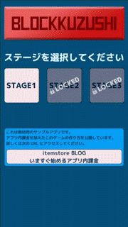
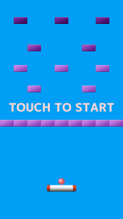
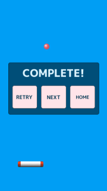

# nonIAP_Sample_Unity_BlockKuzushi

.png "タイトル画面")

.png "Gameover")

- 開発環境は Unity 2017.2.0f3 (64bit) です。
- このプロジェクトは [いますぐ始めるアプリ内課金 - itemstore BLOG](http://blog.item-store.net/archive/category/いますぐ始めるアプリ内課金) の教材サンプルです。ブロック崩しのほかに、アプリ内課金の実装方法についても説明しているので、よろしければご覧ください。
- [GooglePlay のブロック崩し（教材）](https://play.google.com/store/apps/details?id=com.SakuraCrowd.test_nonIAP_Unity_BlockKuzushi) から Android 端末(4.2以上)にダウンロードしてプレイできます。
- [プレイデモ動画](https://youtu.be/kytPGABPxFI) もご覧になれます。
- このプロジェクトにはアプリ内課金の機能は含まれていません。
- ライセンスに基づき利用していただいてかまいませんが、私は一切の責任を負わず、ご質問やご要望にも対応しないことをご理解ください。

# Unity での開き方
1. Clone or Download などで sample_blockkuzushi を丸ごとダウンロードします。
1. 圧縮ファイルならば展開します。
1. ダウンロードしたフォルダを Unity の Open で選択し開きます。

# エディタ上でのプレイ方法
Project タブで Assets/Scene/Title シーンを開きます。  
タイトル画面が表示されたら、再生マークのボタンを押すとマウスでプレイすることができます。

# ビルド方法

Android の apk をビルドするためには、メニュー File > Build Settings で Android を選択します。  
その後、 Build ボタンを押すと作成されますが、その前に以下の設定が必要です。  
教材サンプルでは、その部分が未設定ですので、設定してからビルドしてください。  

Player Settings ボタンを押すと inspector に Android のビルドに関する設定が表示されます。  
そこで以下の設定をしてください。  

- Player Settings
  - Company Name : 作者や製作会社の名前を設定します。
  - Product Name : アプリの名前を設定します。
  - Other Settings
    - Package Name アプリのパッケージ名を設定します。
    - Version : アプリのバージョンを設定します。 1.0 など。
    - Bundle Version Code  : 整数のバージョンコードです。 1, 2, 3 など。
  - Publishing Settings
    - Keystore を作成して選択してください。ビルドする際には Keystore password を 2 箇所に入力する必要があります。
